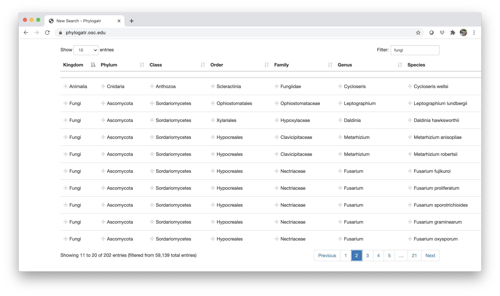

# 1. Purpose 
#### **Genetic diversity** refers to variation in the base pairs of DNA. This genetic diveristy is resposible for the diversity we observe within species (e.g., thermal tolerance, body size). This diversity is essential if species are going to survive environmental change and we can sequence DNA from individuals within a species to obtain measures of genetic diversity.The [Convention on Biological Diversity (CBD)](https://www.cbd.int/){target="_blank" rel="noopener"} included genetic diversity among its 2010 biodiversity targets.

#### The [IUCN red list](https://www.iucnredlist.org/){target="_blank" rel="noopener"} is an international effort to list species as either least concern (LC), near threatened (NT), vulnerable (VU), endangered (EN), or critically endangered (CR) in order to adequately protect species that are in need. 

#### This exercise will use data from an open-source genetic database to answer the question: Is the IUCN red list designed to help protect species with low genetic diveristy that would put them at a higher risk of extinction?

# 2. Learning objectives:
1. Explain why genetic diversity is an important concept in conservation biology.
2. Provide examples as to why open-source databases are valuable tools in conservation biology.
3. Conduct data analysis using the R statistical computing language.
4. Interpret plots in order to answer a research question.

# 3. Download genetic data
PhylogatR is a database that supplies users with DNA sequence data from thousands of species that are ready to analyze (genetic data takes a lot of preparation before it can be used for data analysis).

Choose a taxonomic group to study for the above question. Navigate to the [PhylogatR](https://phylogatr.org/){target="_blank" rel="noopener"} website to download data. In the example below, `fungi` was typed into the filter box, but you can also click on any names to keep those in your search. If you choose to type in a filter, you will want to check the search list because it will retain anything that has `fungi` in the name. For example, see row two below (Family: Fungiidae). It is a coral, which is an animal, but the Family name has `fungi` nested within it. If you only want fungi, you will need to click on `fungi` under Kingdom so everything else is removed.



The data you will download from PhylogatR will consist of a series of folders for each species. In each folder there will be unaligned and aligned fasta files for each locus[^1] that is present for that species in the database. These files contain the genetic data for a species. A fasta file is a specific data format that exists so programs can recognize a file as one that contains DNA sequences. Unaligned fasta files will have the .fa extension and aligned fasta files will have the .afa extension. You will use the aligned files for your analysis.

In addition to these files, each species folder will contain an occurrence file, named `occurrences.txt`. This file contains geographic coordinates associated with each DNA sequence. In the root folder of your download, you will find a `genes.txt` file that includes metadata from your download, such as taxonomy for each species, number of individuals per alignment, and how many sequences were removed after data cleaning steps.

Your download will be a zip file called `phylogatr-results`. If you are using a Mac, the zip file will unzip when you double click on it. If you are using Windows, you must extract the files first (this is very important, otherwise the computer won't recognize the file).

[^1]: A locus is a specific position in the genome where a particular gene or genetic marker is located. As such, not all loci necessarily correspond to a gene. Because PhylogatR alignments reflect genetic data uploaded to GenBank, you may also encounter alignments representing anonymous loci.

# 4. Download IUCN data

Navigate to the [IUCN red list](https://www.iucnredlist.org/){target="_blank" rel="noopener"} website. 
You will need to create an account to download data.

* Click on `Advanced`
* On the right tool bar, click on `Taxonomy`
* Click the appropriate check boxes/arrows to narrow the selection down to your group
* Download the `Search Results`

Your download will be a zip file called `redlist_species_data_` followed by a long list of numbers and letters. If you are using a Mac the zip file will unzip when you double click on it. If you are using Windows, you must extract the files first. 

###**IMPORTANT**: Stay organized. Put every file from this download into the phylogatr-results folder. If you do not do this, R will not be able to find your files later for import. Put that folder somewhere you can easily find it.

# 5. R and RStudio
R is a language and environment for statistical computing and graphics.

RStudio is a set of integrated tools designed to help you be more productive with R.

You will need to install R and RStudio on your computer. See [here](https://rstudio-education.github.io/hopr/starting.html){target="_blank" rel="noopener"} for instructions.

You will need to load  R packages in order to obtain the functions necessary for the analyses that will be conducted. If you have not already installed these packages, you will need to do that first. See [here](https://www.neonscience.org/packages-in-r){target="_blank" rel="noopener"} for more information on package installation in R. You will need to install the following packages using the `install.packages()` function. You only need to install packages once on your computer, but you need to load the library every time you open a new R session.

* ggplot2
* tools
* adegenet
* ape
* pegas
* stringr
* tidyr

For example, copy and paste `install.packages("tools")` into the console in R (bottom left). Do the same thing for each package that needs to be installed.

If R asks if you'd like to update other packages, go ahead and click yes.

> ## R package issues ##
If you are still having issues with installing these packages you can use RStudio to update R using the following code. You will need to reinstall any packages that have already been installed before you took this step.
For Windows:
```{css, echo = FALSE}
.indent {
 margin-left: 30px;
}
```
```{r eval=F, class.source="indent", class.output="indent"}
install.packages("installr")
library(installr)
updateR()
```
> If you are using a Mac, you can go [here](https://cloud.r-project.org/bin/macosx/) and install the newest version on your computer. Restart RStudio and the latest verion of R should be running.

###Load the libraries (i.e., packages)
Since all these packages will be used, load them all now. You might get some warning messages, but these are usually ok, so let's ignore them.
```{r message=F, warning=F}
library(ggplot2)
library(tools)
library(adegenet)
library(pegas)
library(stringr)
library(tidyr)
```

###**IMPORTANT**: Tell R which working directory (i.e., folder) you would like to work from. 

* Click on `Session` in the RStudio tool bar at the top of your screen 
* Click on `Set Working Directory` -> `Choose Directory`
* Find your `phylogatr-results` folder and choose it

####The following examples will be from the Phylum Mollusca. Your plots should look similar but they won't be exactly the same.

# 6. Import IUCN data
This imports the csv file and creates and R object called assessments.
```{r message=FALSE, warning=FALSE}
assessments <- read.csv("assessments.csv")
```

In the upper right block of RStudio you will see an `Environment` tab. Click on it if it is not already chosen. Under `Global Environment` you will see the objects from your R session. You can click on the `assessments` object to view it.

You can use R to list the column headers.
```{r message=FALSE, warning=FALSE}
names(assessments)
```
We are the most interested in columns 3 and 4, so lets clean it up a little so it is easier to use later.

```{r message=FALSE, warning=FALSE}
assessments <- assessments[,3:4]
```

Create a plot to look at the distribution of red listings in this group.
```{r message=FALSE, warning=FALSE}
ggplot(assessments, aes(x=redlistCategory, fill=redlistCategory)) + geom_bar() + scale_fill_brewer(palette = "Paired") + theme(axis.title.x=element_blank(), legend.position = "none") + theme(axis.text.x = element_text(angle = 25))
```

We can also view these in a table.
```{r}
table(assessments$redlistCategory)
```

**What do all the categories mean?** Hint: Your dataset might not contain all these categories. Some of them are older categories that need to be updated in the database.

**Take a look at each category for your group. What is the most frequent category? Compare with your classmates.**

# 7. Import and summarize sequence data

To get the information we need from all the sequence alignments from our PhylogatR download, we'll first create a list of all the sequence alignments and put them in an object called `myfiles`. 
```{r}
myfiles <- list.files(pattern = ".afa", full.names=TRUE, recursive = TRUE)
```

Here we loop through the list stored in `myfiles` to calculate genetic diversity for each sequence alignment. All data will be written to a csv file called `phylogatr-data.csv` and stored in the current working directory. This step will take a few minutes to run, and will take longer if you have a lot of species.
```{r eval=F}
for (f in myfiles) {

  #get species and gene name
  sp <- basename(f)
  sp <- file_path_sans_ext(sp)
  
  #read in fasta file
  seq <- fasta2DNAbin(f, quiet=TRUE)
  
  #get number of sequences
  n <- nrow(seq)

  #calculate nucleotide diversity
  pi <- nuc.div(seq)
  
  #write data to file
  write.table(data.frame(sp, pi, n), file="phylogatr-iucn.csv", quote=FALSE, row.names=FALSE, col.names=!file.exists("phylogatr-data.csv"), append=TRUE, sep=",")
}
```

# 8. Merge IUCN and genetic data results
First, import the output from the previous step, then look at the column headers.
```{r}
genetics <- read.csv("phylogatr-iucn.csv")
names(genetics)
```
sp = species

pi = nuceotide diversity

n = the number of sequences

Now, we can merge the data from both databases. We have two objects in our R environment. 1) `assessments` has the IUCN data and 2) `genetics` has the calculated genetic diversity. 

We'll need to reformat the species names from PhylogatR so they can match those found on the IUCN database. The species names will be merged and if there is a species that has data from both databases, it will be saved in a new R object.

```{r warning=F}
#reformat PhylogatR species names
genetics$sp <- sub("-", " " ,genetics$sp)
genetics <- separate(genetics, sp, into=c("scientificName", "gene"), sep="-")

#merge
dataset <- merge(assessments, genetics, by = "scientificName")
names(dataset)
```

Remember, you can click on objects in your R Environment to view them.

This is what the first six lines of the mollusc data look like.
```{r}
head(dataset)
```

**How many species had both genetic and IUCN red list data from your group? Compare with your classmates.**

# 9. Data analysis
First, we'll make a plot to visualize our data. This is a plot of mean nucleotide diversity found within each red list category.
```{r}
#calculate mean nucleotide diversity for each group
mean_pi <- aggregate(dataset$pi, list(dataset$redlistCategory), mean, na.rm=T)

ggplot(mean_pi, aes(x = Group.1, y = x, fill = Group.1)) + geom_bar(stat = "identity") + scale_fill_brewer(palette = "Paired") + theme(axis.title.x=element_blank(), legend.position = "none") + theme(axis.text.x = element_text(angle = 25)) + ylab("nucleotide diversity (pi)")
```

Now we can test whether there is a significant difference in nucleotide diversity between those species that are threatened and those that are not. A t-test compares two groups so first we'll group categories into threatened and not-threatened and call them as such. We'll remove the data deficient species (notice we are overwriting the `dataset` object and it will no longer contain the data deficient assessments).
```{r}
dataset<-dataset[!(dataset$redlistCategory=="Data Deficient"),]

notthreatened<-c('Near Threatened', 'Least Concern', 'Lower Risk/least concern', 'Lower Risk/near threatened')
for (i in 1:nrow(dataset)) {
  if (dataset$redlistCategory[i] %in% notthreatened) {
    dataset$category[i] <-'notthreatened' 
  }
  else {
    dataset$category[i] <-'threatened'
   }
}
```

Compare the two groups.
```{r}
threatened <- dataset$pi[dataset$category=="threatened"]
notthreatened <- dataset$pi[dataset$category=="notthreatened"]

t.test(threatened, notthreatened)
```
In this case there is a significant difference in genetic diversity among those species that are listed as threatened vs. not threatened.
